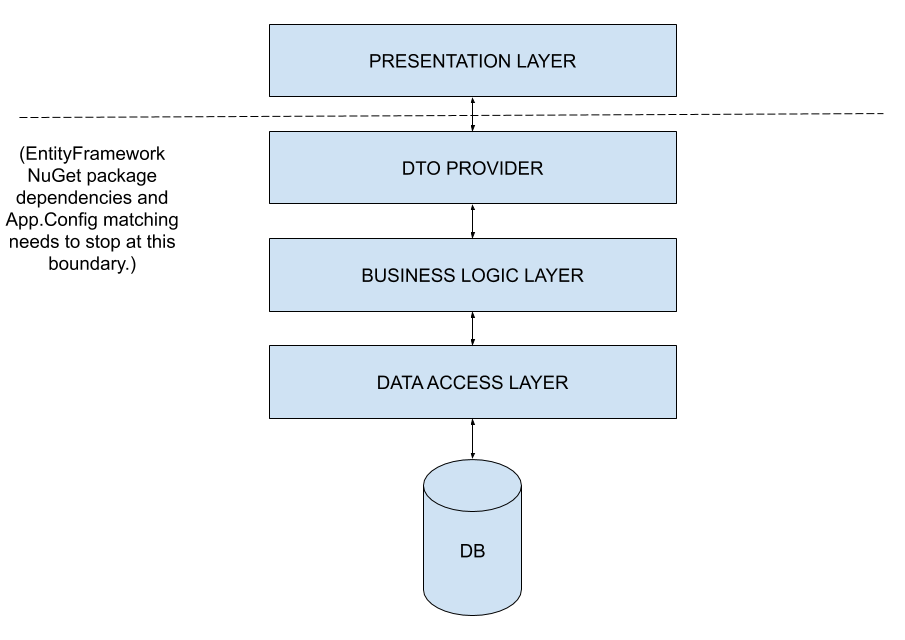

# `MyBlogLister` sample app

This app is developed to test how to separate concerns.  We want to rely on a trivial, `SqlLocalDb`-hosted, `.mdf`-file based, SQL Server database of `Blog`s and `Post`s to list my blogs and their posts, but we do not want to have to drag the `EntityFramework` library, as well as matching `App.config` files, around with us all over the place.

So we are going to design layers:

